# ChronoAI — Timetable Management & Scheduling System

ChronoAI is a web application designed for academic institutions to generate and manage conflict-free timetables for multiple class sections (e.g., Section 1-A and Section 1-B). It utilizes a recursive backtracking scheduling engine with symmetry-breaking optimization to resolve faculty assignments, subject period allocations, and pre-booked lab slots.

A key highlight of ChronoAI is its **Dual-Mode Connectivity**: it functions as a full-stack application connecting a React frontend, an Express REST API backend, and a MySQL database, but features an automatic, real-time heartbeat monitor that seamlessly falls back to `localStorage` offline operations if the backend server becomes unreachable.

---

## 🛠 Tech Stack & Purpose

The project uses a clean, modern tech stack designed for responsive user interfaces, reliable backend routing, and persistent database storage.

### 1. Frontend
*   **React (v19.2)**: For building interactive and reusable UI components. It manages complex local state for timetables, logs, active sessions, and data management forms.
*   **Vite (v8.1)**: Serving as the build tool and development server, providing fast Hot Module Replacement (HMR) and optimized production builds.
*   **Lucide React (v1.23)**: Provides clean, vector-based iconography used throughout dashboards and navigation panels.
*   **Vanilla CSS**: Employed for design aesthetics. Configured with a system of CSS variables (under `[data-theme="dark"]` and `[data-theme="light"]`) for a dark/light mode, custom glassmorphism panels, and smooth micro-animations.

### 2. Backend
*   **Express (v5.2)**: A minimalist web framework for routing REST API endpoints.
*   **CORS**: Middleware configured to allow credentials and coordinate API requests from the frontend origin (`http://localhost:5173`).
*   **Dotenv**: Loads environment variables (database credentials, server port, secrets) securely from a `.env` file.
*   **UUID (v14.0)**: Used to generate unique IDs for active login sessions and email simulation logs.
*   **Bcryptjs**: Included in the stack to support secure cryptographic password hashing.

### 3. Database
*   **MySQL**: Relational database that acts as the persistent system of record.
*   **mysql2 (v3.22)**: Relational database client supporting promise-based querying (`mysql2/promise`) and connection pooling to ensure safe, scalable, and non-blocking database access.

---

## 📂 Project Architecture & File Directory

The codebase is organized into client-side (`frontend/`) and server-side (`backend/`) components, with database files in (`database/`):

```text
├── package.json               # Root orchestrator scripts (installs and runs both sub-projects)
├── database/                  # Database initialization scripts
│   └── schema.sql             # SQL script defining tables, keys, and default seed records
├── frontend/                  # React Frontend project
│   ├── package.json           # Frontend dependencies and run scripts
│   ├── vite.config.js         # Configuration for Vite and React plugins
│   ├── index.html             # Main entrypoint HTML containing the React app root
│   ├── .oxlintrc.json         # Linter configuration
│   ├── public/                # Static public assets
│   └── src/                   # React Frontend Source Code
│       ├── main.jsx           # Renders the App component into the root DOM
│       ├── App.jsx            # App shell, routing (tabs), theme state, and login wrapper
│       ├── App.css            # Compact utility classes
│       ├── index.css          # Central styling system (CSS variables, animations, scrollbars)
│       ├── components/        # Interactive Dashboard Panels
│       │   ├── HODDashboard.jsx   # Core HOD interface (CRUD for Staff/Subjects, Solver UI, Logs)
│       │   ├── StaffDashboard.jsx # Faculty interface (personal published timetable, weekly stats)
│       │   ├── LabScheduler.jsx   # Grid component for booking admin-locked lab slots
│       │   ├── ActiveUsersPanel.jsx # Session monitoring dashboard for active/inactive logins
│       │   └── StudentDashboard.jsx # Student-specific view (for future/expanded portals)
│       └── services/          # Core Logic & API client layer
│           ├── db.js              # Client-side DB adapter with server health heartbeat & LS fallback
│           └── solver.js          # Backtracking scheduling engine & real-time conflict validator
└── backend/                   # Node.js Express Backend project
    ├── package.json           # Backend dependencies and run scripts
    ├── .env                   # Environment variables (DB user, host, ports, keys)
    ├── index.js               # Main Express app, configuration, and API router assembly
    └── routes/                # Sub-routers mapping DB queries to REST endpoints
        ├── auth.js            # Handles `/api/auth/login` and `/api/auth/logout` sessions
        ├── staff.js           # CRUD endpoints for managing staff records
        ├── subjects.js        # CRUD endpoints for course info and teacher allocations
        ├── timetable.js       # Handles draft saves, publishing, notifications, & email alerts
        ├── settings.js        # Stores/retrieves configurable variables (e.g. periods per day)
        ├── sessions.js        # Fetches session history and online users for HOD
        ├── email_logs.js      # Logs simulation of automated/custom email transmissions
        └── lab_slots.js       # Manages manual admin-locked lab bookings in DB
```

---

## 🔗 Data Flow & Integration Layer

The connections between Frontend, Backend, and Database operate through a unified API adapter layer featuring an offline safety net.

### How Frontend, Backend, and Database Connect

```mermaid
sequenceDiagram
    participant UI as React Frontend Components
    participant DBService as db.js Service Wrapper
    participant Express as Express Backend Server
    participant MySQL as MySQL Database
    participant LS as Browser LocalStorage (Fallback)

    Note over UI, LS: System checks Server Health in background every 5 seconds
    
    rect rgb(20, 24, 33)
        Note right of DBService: ONLINE PATHWAY
        UI->>DBService: Call database method (e.g., getStaff())
        DBService->>Express: HTTP GET /api/staff
        Express->>MySQL: execute Query ("SELECT * FROM staff")
        MySQL-->>Express: Return database rows
        Express-->>DBService: Return JSON payload
        DBService->>LS: Sync & cache latest copy in LocalStorage
        DBService-->>UI: Return data to update React state
    end
    
    rect rgb(30, 20, 20)
        Note right of DBService: OFFLINE / FALLBACK PATHWAY
        UI->>DBService: Call database method (e.g., getStaff())
        DBService->>DBService: Identify Server Offline
        DBService->>LS: Retrieve local copy from LocalStorage ('_staff')
        LS-->>DBService: Return cached JSON
        DBService-->>UI: Return data to update React state
    end
```



1.  **Background Heartbeat Monitor**: In `src/services/db.js`, a background interval issues an abort-capped request (`200ms` limit) to `/api/health` every 5 seconds. This updates the boolean `isServerOnline`.
2.  **API Requests**: When components invoke a method on the `db` service wrapper:
    *   **If server is online**: An asynchronous `fetch` request is sent to `http://localhost:3001/api`. The server receives the request, pulls a connection from the `mysql2` pool, executes SQL statements, and sends back JSON. The `db` wrapper updates local storage with a cached copy and returns the data to React.
    *   **If server is offline**: The request fails instantly. The `db` wrapper falls back immediately to query browser `localStorage` (which starts with pre-seeded mock records), enabling the app to operate offline.
3.  **Active Session Sync**: During login, a session record is written to both the MySQL database (`login_sessions`) and browser `localStorage` (`_sessions`). This allows the HOD to track active users currently logged in, showing details like login time, name, email, role, and active status.

---

## 🗄 Database Schema Design

The MySQL schema is defined in `database/schema.sql`. Data is organized into 9 relational tables:

### 1. `staff`
Stores information about teaching staff and administrators.
*   `id`: `VARCHAR(20) PRIMARY KEY` (e.g. `'STF001'`).
*   `name`: `VARCHAR(100)` (Name of the faculty member).
*   `email`: `VARCHAR(150) UNIQUE` (Used for notifications and logins).
*   `password`: `VARCHAR(255)` (Plaintext demo pass or hash).
*   `created_at`, `updated_at`: Timestamps.

### 2. `subjects`
Holds course information.
*   `id`: `VARCHAR(20) PRIMARY KEY` (Course Code, e.g., `'CS101'`).
*   `name`: `VARCHAR(150)` (Name of course, e.g., `'Java'`).
*   `type`: `ENUM('theory', 'practical', 'language')` (Crucial for the backtracking algorithm constraints).
*   `periods`: `INT` (Total number of periods required weekly, default `4`).

### 3. `assignments`
Maps which teacher is assigned to teach which course in which student section.
*   `id`: `INT AUTO_INCREMENT PRIMARY KEY`.
*   `section`: `VARCHAR(10)` (Target class, e.g. `'1-A'`).
*   `subject_id`: `VARCHAR(20)` (Foreign Key referencing `subjects(id)`).
*   `staff_id`: `VARCHAR(20)` (Foreign Key referencing `staff(id)`).
*   *Constraints*: Unique index on `(section, subject_id)` prevents assigning multiple teachers to the same course within a single section.

### 4. `settings`
A simple key-value store for global scheduler variables.
*   `setting_key`: `VARCHAR(100) PRIMARY KEY` (e.g., `'periodsPerDay'`, `'timings'`).
*   `setting_value`: `TEXT` (Holds configurations such as the JSON representation of daily slot timings).

### 5. `timetable`
Stores saved drafts and active schedules.
*   `id`: `INT AUTO_INCREMENT PRIMARY KEY`.
*   `status`: `ENUM('draft', 'published')` (Determines if the timetable is visible to staff dashboards).
*   `tables_json`: `LONGTEXT` (Stores the generated conflict-free grid structured as a JSON block mapping `{ section: { dayOrder: { period: { subjectId, staffId... } } } }`).

### 6. `lab_slots`
Maintains manual administrative bookings.
*   `id`: `INT AUTO_INCREMENT PRIMARY KEY`.
*   `section`: `VARCHAR(10)`.
*   `day_order`: `INT` (Day 1 to 6).
*   `period`: `INT` (Period 1 to 5).
*   `subject_id`, `staff_id`: Foreign keys mapping back to `subjects` and `staff` tables.
*   *Constraints*: Unique index on `(section, day_order, period)` prevents overlapping lab slots in a single section.

### 7. `notifications`
Holds alerts generated during academic scheduling events.
*   `id`: `VARCHAR(20) PRIMARY KEY`.
*   `title`: `VARCHAR(200)` and `message`: `TEXT`.
*   `recipient_id`: `VARCHAR(50)` (`'all'` or a specific `staff_id`).
*   `is_read`: `TINYINT(1)` (Read status flag).

### 8. `email_logs`
Logs mock emails triggered by system events (such as publishing the timetable or sending custom notes).
*   `id`: `VARCHAR(50) PRIMARY KEY`.
*   `recipient_email`, `recipient_name`: User identifiers.
*   `subject`, `body`: Email text structures.
*   `sent_at`: Sent timestamp.

### 9. `login_sessions`
Tracks active user sessions to support real-time active user dashboards.
*   `id`: `VARCHAR(50) PRIMARY KEY` (Corresponds to a generated UUID session token).
*   `user_role`: `ENUM('hod', 'staff')`.
*   `user_id`: `VARCHAR(50)`.
*   `user_name`, `user_email`: Session details.
*   `login_at`, `logout_at`: Access timestamps.
*   `is_active`: `TINYINT(1)` (Active status flag).

---

## 🤖 The Scheduling Engine (Solver Details)

The core logic lies in `src/services/solver.js`. It runs a **backtracking search** to generate timetables:

1.  **Preset Lab Slots Initialization**: It reads slots defined in `lab_slots` and locks them first. No generated class can override these.
2.  **Backtracking Loop (`solveSection`)**: For each section, the engine takes the list of pending allocations and attempts to place them into the day-order grid sequentially.
3.  **Strict Constraint Checks**:
    *   **Faculty Conflict**: Faculty member `staffId` cannot teach multiple classes during the same `(day, period)`.
    *   **Daily Max Limits**: Special daily subjects (like languages) are restricted to 1 period max per day order. Single subjects cannot exceed 1 period per day (or a hard limit of 2).
    *   **Double-Period Labs**: Practical courses (`type === 'practical'`) are scheduled in 2 consecutive periods. The algorithm prevents double-period labs from splitting across tea breaks.
4.  **Symmetry Breaking**: Optimizes execution speed. If consecutive identical course slots are scheduled, the algorithm restricts searching to slots following the previous allocation. This prevents redundant searches, keeping response times under 50ms.
5.  **Conflict Validation**: When changes are edited manually, a companion function `validateTimetable` checks for double-bookings or over/under-allocated periods, listing warnings dynamically.

---

## 🚀 Setup & Installation Guide (From Scratch)

Here is a step-by-step walkthrough to assemble, configure, and boot the ChronoAI application.

### Step 1: Clone and Restore Dependencies
1. Navigate to the project root directory.
2. Install dependencies for both frontend and backend concurrently:
   ```powershell
   npm run install:all
   ```

### Step 2: Configure Environment Variables
Create a `.env` file inside the `backend` folder containing the database access parameters:
```env
# Database Credentials
DB_HOST=localhost
DB_PORT=3306
DB_NAME=chronoai_timetable
DB_USER=root
DB_PASS=your_mysql_password_here

# Server Configuration
PORT=3001
FRONTEND_URL=http://localhost:5173
```

### Step 3: Database Setup
1. Log into your MySQL prompt:
   ```powershell
   mysql -u root -p
   ```
2. Create the target database schema and tables by running the SQL script:
   ```sql
   SOURCE database/schema.sql;
   ```
   *(This creates the database, initializes all 9 tables, and seeds default staff, course, and config records).*

### Step 4: Running the Application
Launch both frontend and backend components concurrently from the root directory:
```powershell
npm run dev
```
*(This uses `concurrently` to launch the Express API server on port 3001 and the Vite development server on port 5173. Visit the dashboard at `http://localhost:5173`!)*

---

## 🔑 Demo Access Credentials
You can log into the system with the following demo credentials (which match the seeded SQL values):

| User Type | Email / Username | Password | Role Description |
| :--- | :--- | :--- | :--- |
| **HOD Admin** | `hod@college.edu` | `Admin123` | Full access: edit staff, adjust subject periods, lock labs, generate timetables |
| **Staff Member** | `STF001` or `sangeetha@college.edu` | `StaffPassword1` | View personal teaching schedule and system notifications |
| **Staff Member** | `STF004` or `murugan@college.edu` | `StaffPassword4` | Shared faculty member assigned to courses across multiple sections |
